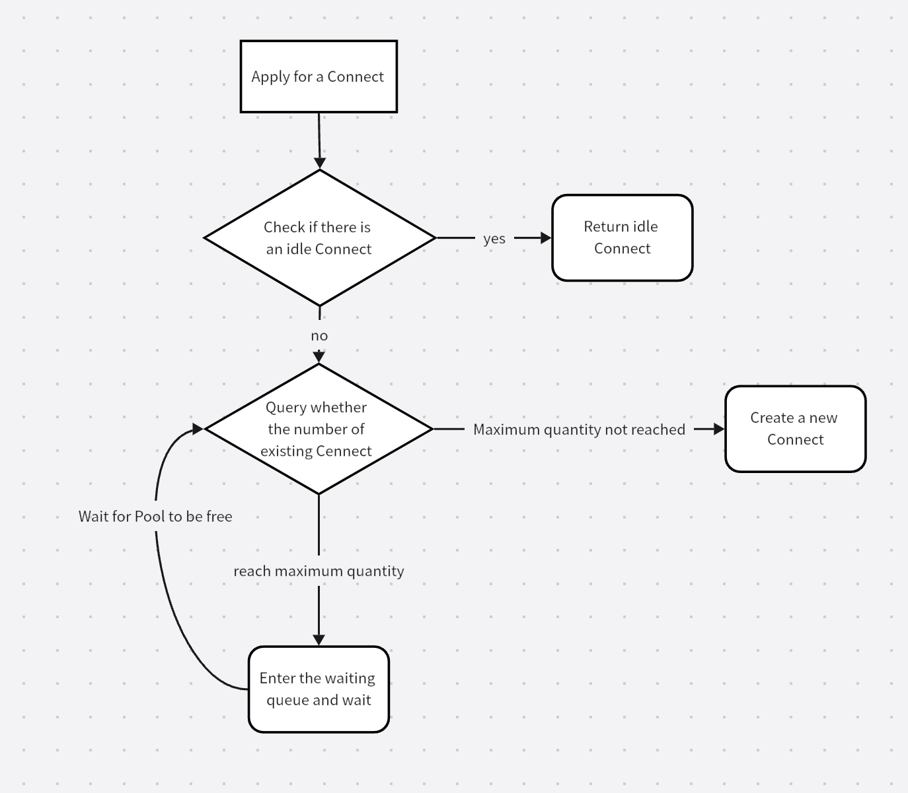

# Golang 高并发连接池

[英文文档](./README.md) | [中文文档](./README_CN.md)

`Connect Pool` 是一个Go语言包，旨在高效地管理连接池。它抽象了处理多个并发连接的复杂性，确保了资源的最优利用，并简化了创建、使用和处理连接的过程。本文档概述了连接池的功能，并提供了如何在Go应用程序中使用它的指南。

## 功能特性

- **动态连接管理：** 根据需求自动创建和关闭连接，直至达到指定的最大池大小。
- **连接复用：** 允许闲置连接的复用，减少建立新连接的开销。
- **并发安全：** 设计用于多个goroutine并发使用时的安全性。
- **自动清理：** 定期清除超过指定最大空闲时间的闲置连接，帮助释放未使用的资源。
- **异常处理：** 提供机制处理连接操作期间发生的panic，增强应用程序的鲁棒性。
- **自定义连接逻辑：** 支持自定义连接创建、关闭和panic处理函数，以适应特定需求。



## 使用指南

以下是如何在Go应用程序中集成和使用连接池的基本指南。

### 安装

确保您的机器上安装了Go（访问[Go的官方网站](https://golang.org/dl/)获取安装说明）。然后，将连接池包导入到您的项目中：

```go
import "github.com/HuXin0817/ConnectPool"
```

### 创建新的连接池

创建新的连接池时，您需要指定池的最大大小以及定义每个连接如何建立的函数：

```go
pool := pool.NewConnectPool(100, mockConnectMethod)
```

`mockConnectMethod`是一个返回新连接对象的函数。每当池需要创建新连接时，就会调用此方法。

### 注册并使用连接

从池中使用连接时：

```go
conn, cancelFunc := pool.Register()
// 使用连接
cancelFunc() // 将连接释放回池中
```

### 设置自定义处理程序

您可以设置自定义方法来处理连接关闭和panic情况：

```go
pool.SetCloseMethod(mockCloseFunc)
pool.SetDealPanicMethod(mockDealPanicMethod)
```

### 配置自动清理参数

可以配置池自动清理超过某个持续时间的闲置连接：

```go
pool.SetMaxFreeTime(30 * time.Second) // 设置连接被关闭前的最大空闲时间
pool.SetAutoClearInterval(1 * time.Minute) // 设置自动清理过程的间隔
```

### 关闭池

关闭池并释放其所有资源：

```go
pool.Close()
```
